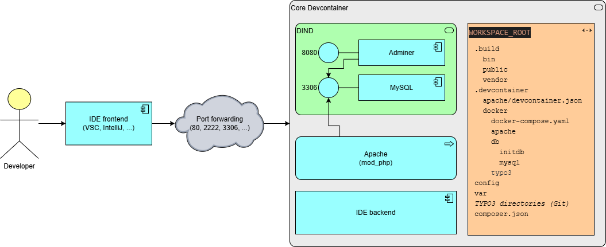
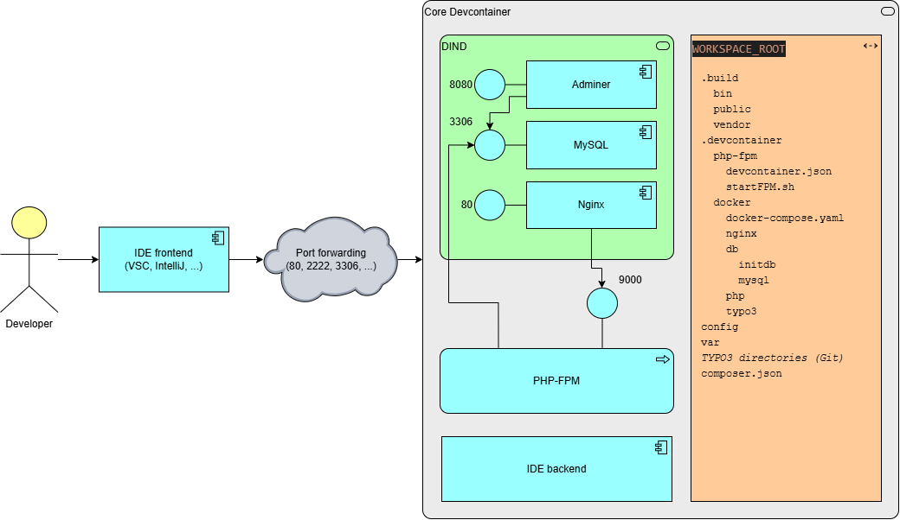

# TYPO3 Dev Container Configuration

Normally a TYPO3 setup consists of the following main parts

* PHP version as required by TYPO3 with the needed extensions enabled
  * XDebug support enabled for development needs
* a webserver that
  * is enabled to process the *.php files in the TYPO3 folders
  * properly configured with secure filters and rewrite rules
* a database backed supported by TYPO3 version

This Devcontainer blueprint is based upon the following ruleset:

* we make use of Docker-In-Docker (DIND) within the core devcontainer to provide the best "local-lookalike-feeling" for developers who could thereby launch any additional docker service they want
* the core devcontainer environment contains the PHP environment needed for the designated TYPO3 version in addtion to the souce code checked out into the working directory
* a webserver could be startet either within the core devcontainer (apache) or as a supporting docker container
* a database backend (with the exclusion of SqLite) is started as a separate docker service

## Configurations provided

### Apache, PHP 8.4, MariaDB

The `apache` subdirectory contains Devcontainer configuration for running Apache web server along PHP 8.4 basen on Debian Trixie.

### PHP 8.4-FPM, Nginx, MariaDB

The `php-fpm` subdirectory contains Docker configuration for PHP 8.4 FastCGI Process Manager in conjunction with Nginx webserver running as a DIND docker service:

### FrankenPHP 8.4 Classic, MariaDB  (Default)

The `frankenphp` subdirectory contains Devcontainer configuration for running FrankenPHP 8.4 based on Debian Trixie.

FrankenPHP currently *only* runs in classic mode. Unfortunately worker mode is not supported by TYPO3 at this point of time.

## Getting started

* Login to Github WebUI and select the desired branch
* select the dropdown field `<> Code` / Tab `Codespaces`
* in the rown `Codespaces` select the three dots 
  (choosing `+` will launch the default configuration)
* select `+ New with options...`
  * verify that the correct branch is selected
  * choose the desired devcontainer configuration
  * verify the region
  * choose a machine type (2 cores should be fine to start)
* select `Create codespace` 
  Now a VS Code UI opens in the browser window.
  * please be VERY patient now because all containers have to be build initially including the whole TYPO3 environment. You may follow the progress by pressing `Building codespace...` link in the bottom right corner: 
   
  If you later start the codespace again it will come up quickly.
