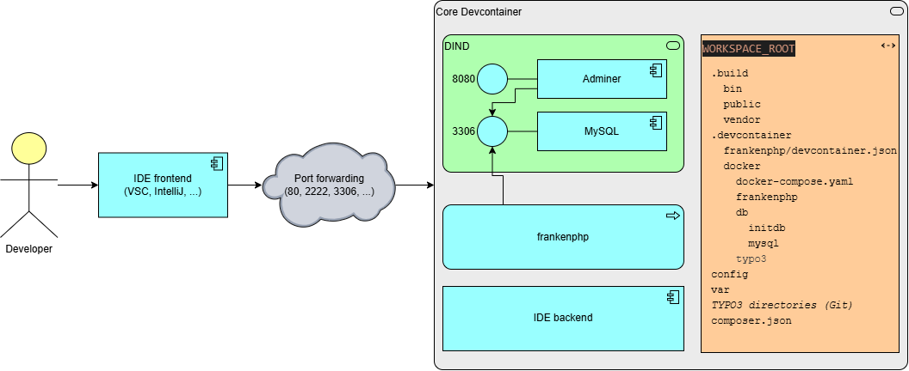
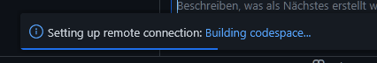

# Typo3 (typo3)

A template to support remote development with TYPO3.

## Options

| Options Id | Description | Type | Default Value |
|-----|-----|-----|-----|
| phpVersion | Select the PHP version to use in the development container. You may choose PHP version from 8.2 to 8.5. | string | 8.4 |
| webserver | Which webserver do you prefer? | string | frankenphp |
| database | Which database would you like to use in your development environment? | string | mysql |

### Disclaimer

Development with TYPO3 is commonly done using [DDEV environment](https://docs.ddev.com/en/stable/users/quickstart/#typo3). Mainly designed for local use in Docker environment DDEV is being brought also to Codespaces and Kubenetes environments. Anyway DDEV is not outdated though Devcontainer technology seems to be more a standard technology the more tooling support is added. It could be easily used in either local or remote development environments (SAAS, on-prem, private cloud).

## Additional information

Normally a TYPO3 setup consists of the following main parts

* PHP version as required by TYPO3 with the needed extensions enabled
  * XDebug support enabled for development needs
* a webserver that
  * is enabled to process the *.php files in the TYPO3 folders
  * properly configured with secure filters and rewrite rules
* a database backed supported by TYPO3 version

This Devcontainer template is based upon the following ruleset:

* we make use of Docker-In-Docker (DIND) within the core devcontainer to provide the best "local-lookalike-feeling" for developers who could thereby launch any additional docker service they want
* the core devcontainer environment (based on Debian Trixie) contains the PHP environment needed for the designated TYPO3 version in addtion to the souce code checked out into the working directory
* a database backend is started as a separate docker service based on the selected `TYPO3_INSTALL_DB_DRIVER` in the file `.devcontainer/.env` (no backend if `sqlite` is configured)
* if a `composer.json` file is detected during initialization the PHP application will be automatically initialized

### Provided variances

The default configuration consists of:

* `webserver`: `frankenphp`
* `database`: `mysql`
* `phpVersion`: `8.4`

#### Webserver

You may choose between

* FrankenPHP (Default - Value: `frankenphp`)
  
  FrankenPHP currently *only* runs in classic mode comparable to Apache/mod_php or PHP-FPM. Unfortunately worker mode is not supported by TYPO3 at this point of time.

* Apache (Value: `apache`)

#### Database

You may choose between

* MariaDB (Value: `mariadb`)
* MySql (Default - Value: `mysql`)
* PostgreSQL (Value: `postgresql`)
* SQLite (Value: `sqlite`)

#### PHP Version

Currently only variances of FrankenPHP integrated webserver (Caddy) with the following PHP versions are provided:

* `8.2`
* `8.3`
* `8.4` (Default)
* `8.5`

### Requirements

Some requirements regarding the composer configuration are automatically set during initialization before performing install. They MUST NOT be modified afterwards unless you don't want to make use of this devcontainer template anymore.

    composer require --dev "helhum/dotenv-connector": "*", "helhum/typo3-console": "*"
    composer config allow-plugins.helhum/dotenv-connector true
    composer config bin-dir .build/bin
    composer config vendor-dir .build/vendor
    composer config extra.typo3/cms.web-dir .build/public
    composer config extra.helhum/dotenv-connector.env-file TYPO3.env

Additionally the directory `var` is used for several purposes incl. apache logfiles hosted in `var/log/apache2`.

## Useful hints

* `README.md` in `.devcontainer` holds additional useful information

* Working in the TYPO3 Devcontainer

  After the TYPO3 devcontainer environment came up you will find in a container running Debian Trixie:

  * User: `typo3dev`
  * Homedirectory: `/home/typo3dev`
  * SUDO-command: *passwordless for any command*
  * Git-Repository: checked out to `${WORKSPACE_ROOT}`

* Re-Initialize TYPO3 environment
  
  If you need to get a clean TYPO3 environment based upon your configuration you may spawn a terminal window and execute
  
   `${WORKSPACE_ROOT}/.devcontainer/docker/igniteEnvironment.sh`

* Update devcontainer template

  If you want to update the devcontainer configuration e.g. after a new template version has been published you can make use of the [Dev Container CLI](https://github.com/devcontainers/cli) with the following command:

      devcontainer templates apply --template-id ghcr.io/thucke/devcontainer-templates/typo3  --template-args "{\"database\": \"mysql\", \"phpVersion\": \"8.4\", \"webserver\": \"frankenphp\"}" -w .

  Valid values:

  * `database`: `mysql` || `mariadb` ||`sqlite` || `postgresql`
  * `phpVersion`: `8.2` || `8.3` || `8.4` || `8.5`
  * `webserver`: `frankenphp` || `apache`

* TYPO3 environment configuration

  You may modify the file `${WORKSPACE_ROOT}/.devcontainer/.env` with caution if you want to adjust some core TYPO3 settings. After this file has been modified it is recommended to rebuild the whole devcontainer.

  **In this file you can find the password of the database root as well as the TYPO3 backend user credentials.**

## Getting started with Devcontainer runtimes

### Github Codespaces

* Login to Github WebUI and select the desired branch
* select the dropdown field `<> Code` / Tab `Codespaces`
* in the rown `Codespaces` select the three dots 
  (choosing `+` will launch the default configuration)
* select `+ New with options...`
  * verify that the correct branch is selected
  * choose the default devcontainer configuration
  * verify the region
  * choose a machine type (2 cores should be fine to start)
* select `Create codespace` 
  Now a VS Code UI opens in the browser window.
  * please be VERY patient now because all containers have to be build initially including the whole TYPO3 environment. You may follow the progress by pressing `Building codespace...` link in the bottom right corner: 
   
  If you later start the codespace again it will come up quickly.

---

_Note: This file was auto-generated from the [devcontainer-template.json](https://github.com/thucke/devcontainer-templates/blob/main/src/typo3/devcontainer-template.json).  Add additional notes to a `NOTES.md`._
